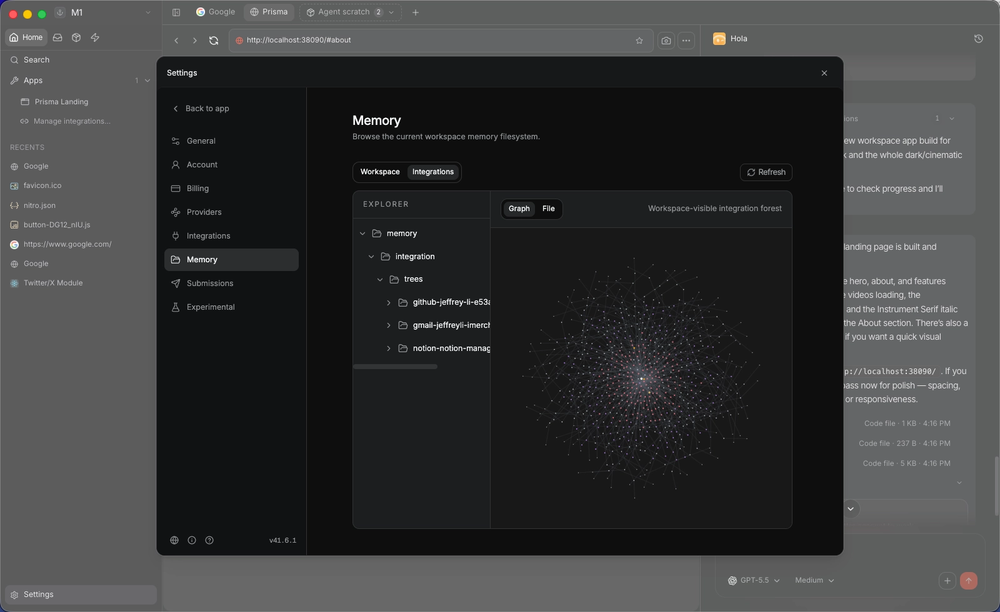

<p align="center">
  
</p>

<p align="center"><strong>Your super agent for work: local- first, learn your working context in mins and never forget it</strong></p>

<p align="center">
  <a href="https://github.com/holaboss-ai/holaOS/actions/workflows/ci.yml"></a>
  
  
  
  
  
</p>

<p align="center">
  <a href="https://x.com/Holabossai"></a>
  <a href="https://discord.com/invite/NSeHUCBj6"></a>
</p>

<p align="center"><strong>⭐ Help us reach more developers and grow the holaOS community. Star this repo!</strong></p>

<p align="center">
  <a href="https://www.holaos.ai/?utm_source=github&utm_medium=oss&utm_campaign=hola_boss_oss&utm_content=readme_nav_website">Website</a> ·
  <a href="https://www.holaos.ai/docs/getting-started?utm_source=github&utm_medium=oss&utm_campaign=hola_boss_oss&utm_content=readme_nav_docs">Docs</a> ·
  <a href="https://www.holaos.ai/signin?utm_source=github&utm_medium=oss&utm_campaign=hola_boss_oss&utm_content=readme_nav_signin">Sign in</a> ·
  <a href="#quick-start">Quick Start</a>
</p>

# HolaOS (What is HolaOS):

<p align="center">
  
</p>
<!-- <p align="center">
  <em>Inside the workspace: apps, files, a completely customizable dashboard, and agent chat live side by side while a single user-facing agent manager coordinates sub agents in the background.</em>
</p> -->

HolaOS is your super agent for work: local-first, learn your working context in mins and never forget it, below are the key features:

-  **With 100+ Integration and Auto-fetch**, Agent know your state of work in mins 
    
    With one-click OAuth, your Agent connects to the tools, browser profile, local files you already use every day — Linear, GitHub, Slack, Jira, HubSpot, Gmail, and 100+ other workplace integrations.
    
    No more copying updates, pasting links, or re-explaining background. Agent automatically fetches (only when you allowed) relevant signals from your tools in mins and turns scattered app data into working memory. Agent brings the right context back when you need it.
    
- **Memory Management system** that let your Agent never forget your working memory
    
    Your Agent never starts work from zero — it remembers your working context, where the work stands, and brings the right memory back when you need to continue. The agent builds a local-first, compressed knowledge base from workspace files, browser state, integrations, and work activity, turning raw data from tools like Gmail, Slack, Notion, GitHub, and Jira into durable memory. Inspired by Karpathy’s LLM wiki workflow, this memory is stored locally as Markdown, embedded with SQLite vec, and retrieved through RAG, preserving key facts and context while making recall faster, more controlled, and easier for both you and the agent to use. You can open, browse and edit. 
    
- **Session Context compression** that keep your working context fresh and token efficiency
    
    The Agent remembers the past without sacrificing its ability to think about the current task. By our Safe Session Compaction: long-running agents are only useful if they stay coherent after days of work, not just one oversized prompt. holaOS keeps roughly 70% of the model window reserved for fresh reasoning, preserves the active working set verbatim, and folds older history into structured checkpoints that retain goals, constraints, progress, decisions, next steps, critical context, and file activity. It cuts history at sensible boundaries when possible, repairs split turns with local prefix summaries when necessary, and
    performs compaction on a snapshot that only merges back if the live session still matches. The result is durable continuity without the usual slow drift into bloated, expensive, fragile sessions. 
    
- **Simple UI & User friendly**
    
    Use agents through a desktop app, not a terminal. You can manage tasks, inspect files, view outputs, and interact with your Agent in one simple UI — no CLI required. A local file system keeps work artifacts out of long conversations, so plans, drafts, notes, generated files, configs, and outputs stay in a visible workspace that both you and the Agent can access and edit. With one account, you can use leading SOTA models without managing separate providers, API keys, or setup. For complex tasks, hidden subagents can work in parallel while the orchestrate agent brings back progress and deliverables as one easy-to-review result. Integrate your Browser profile with one-click to support Agent handle real web-based work across websites, dashboards, and apps beyond standard APIs or integrations.
    
- **Memory never out of you control**
    
    Your Agent learns your work, but your working memory stays in your computer. Built local-first, your data is not locked inside someone else’s cloud.
    
    You can see what the Agent remembers, edit, remove what should not be kept, and control what gets fetched or recalled. Memory is always visible, adjustable, and owned by you.

# Working Agent Memory mechanism

The agent creates a local-first knowledge base from the files, browser state, integrations, and work activity connected to your workspace. Information from tools like Gmail, Slack, Notion, GitHub, and Jira (one - click OAuth) is summarized and compressed before becoming memory, so the agent does not need to search through every raw email, message, document, or ticket from scratch.

Memory is stored locally as Markdown files and embedded with SQLite vec on your machine. This gives the agent a durable structure it can retrieve from through RAG, while keeping the underlying workspace state under your control. Inspired by Karpathy’s LLM wiki workflow, the system turns connected work data into browsable, compressed memory that both you and the agent can use.

This compression layer preserves the important working facts, relationships, and context from the original data while making memory faster to retrieve and easier for the agent to select from. Instead of manually bringing every detail back into the conversation, your workspace maintains a living memory of what has happened, what matters, and where the agent should look next.


<p align="center">
  
</p>

# HolaOS vs Other Agents

A high level overview over core dimensions that impacts agent usage:

|  | OpenClaw | Hermes Agent | Openhuman | HolaOS |
| --- | --- | --- | --- | --- |
| Agent Position | ✅General Agent | ✅General Agent | ✅Personal Agent | 🔥Working Agent |
| Simple to start | ⚠️ Terminal-first | ⚠️ Terminal-first | ⚠️ Basic UI | ✅Production Grade UI |
| Memory | ⚠️ Plugin-reliant | ⚠️ Self-learning | ✅Memory Tree + Obsidian vault, optional agentmemory backend | 🔥Business level Memory Mechanism: Memory Tree + Semantic Embedding + RAG |
| Integrations | 🚫BYOK | 🚫BYOK | ✅118+ via OAuth | 🔥200 + via OAuth + Stable for Working |
| Cost | 🚫BYO Model | 🚫BYO Model | ✅Token Juicy | 🔥Per Native Tool token optimizer |
| API sprawl | 🚫BYOK | ⚠️ Multi-vendor | ✅one-account, single account per integration | ✅one-account + multi account  per integrations |
| Auto-fetch | 🚫None | 🚫None | ✅20-min sync into memory | ✅30-min sync into memory |
| Native tools | ✅Code-only | ✅Code-only | ✅Code + search + scraper + voice | 🔥Code + Web Search +  Browser Use + Wide Search |
| Model selection | 🚫BYOK | 🚫BYOK | ⚠️only one | 🔥one-account all SOTA models |
| Workspace | 🚫None | 🚫None | 🚫None | 🔥Workspace build for Digital Work |


## Table of Contents

- [Quick Start](#quick-start)
    - [What you need](#what-you-need)
    - [One-Line Install](#one-line-install)
- [Documentation](#documentation)
- [Manual Install](#manual-install)
    - [One-Line Agent Setup](#one-line-agent-setup)
- [Contributing](#contributing)
- [OSS Release Notes](#oss-release-notes)

## Quick Start

### One-Line Install

For a fresh-machine bootstrap on macOS, Linux, or WSL, use the repository installer:

```bash
curl -fsSL https://raw.githubusercontent.com/holaboss-ai/holaOS/refs/heads/main/scripts/install.sh | bash -s -- --launch
```

You can also follow the manual path if you want to control each setup step.

## Star the Repository

<p align="center">
  
</p>

<p align="center"><strong>If holaOS is useful or interesting, a GitHub Star would be greatly appreciated.</strong></p>

## Documentation

All deeper technical and product documentation lives at **[holaos.ai/docs](https://www.holaos.ai/docs)**:

| Section | What's Covered |
| --- | --- |
| [Overview](https://www.holaos.ai/docs/getting-started) | The merged entry page for the environment-engineering thesis and system model |
| [Quick Start](https://www.holaos.ai/docs/getting-started/quick-start) | The fastest path to a working local desktop environment |
| [Workspaces](https://www.holaos.ai/docs/getting-started/workspaces) | How workspaces are created, switched, managed, and represented on disk |
| [Environment Engineering](https://www.holaos.ai/docs/concepts/environment-engineering) | The core thesis behind holaOS and why the environment defines the system |
| [Concepts](https://www.holaos.ai/docs/concepts/concepts) | Core system vocabulary for workspaces, runtime, memory, and outputs |
| [Workspace Model](https://www.holaos.ai/docs/concepts/workspace-model) | Workspace contract, authored surfaces, and runtime-owned state |
| [Memory and Continuity](https://www.holaos.ai/docs/concepts/memory-and-continuity) | Durable memory, continuity artifacts, and long-horizon resume behavior |
| [Agent Harness](https://www.holaos.ai/docs/concepts/agent-harness) | The stable harness boundary inside the runtime and how executors fit into it |
| [Independent Deploy](https://www.holaos.ai/docs/contribute/runtime/independent-deploy) | Running the portable runtime without the desktop app |
| [Build on holaOS](https://www.holaos.ai/docs/contribute) | The code-true developer map for desktop, runtime, apps, templates, and validation paths |
| [Start Developing](https://www.holaos.ai/docs/contribute/start-developing) | The local developer path for desktop and runtime validation |
| [Runtime APIs](https://www.holaos.ai/docs/contribute/runtime/apis) | The runtime operational surface for workspaces, runs, streaming, and app lifecycle |
| [Build Your First App](https://www.holaos.ai/docs/build/apps/first-app) | Building workspace apps on top of holaOS |
| [Reference](https://www.holaos.ai/docs/reference/environment-variables) | Environment variables and supporting reference material |


## Manual Install

You likely will not need this section because One-Line Install runs the same setup. Use Manual Install when you want to inspect or control each step. If you use the manual path, verify the usual prerequisites first:

```bash
git --version
node --version
npm --version
```

### One-Line Agent Setup

If you use Codex, Claude Code, Cursor, Windsurf, or another coding agent, you can hand it the setup instructions in one sentence:

```text
Run the holaOS install script from https://raw.githubusercontent.com/holaboss-ai/holaOS/refs/heads/main/scripts/install.sh. It should install git and Node.js 24.14.1/npm if they are missing, clone or update the repo into ~/holaboss-ai unless I specify another --dir, run desktop:install, create apps/desktop/.env from apps/desktop/.env.example if needed, run desktop:prepare-runtime:local and desktop:typecheck, and only run desktop:dev if I ask for --launch. If Electron cannot open, stop after verification and tell me the next manual step.
```

That handoff keeps the installation flow self-contained while leaving the detailed bootstrap steps in the repo-local [INSTALL.md](INSTALL.md) runbook.

This is the baseline installation flow for local desktop development.

1. Install the desktop dependencies from the repository root:

```bash
npm run desktop:install
```

2. Create your local environment file:

```bash
cp apps/desktop/.env.example apps/desktop/.env
```

If you are following the repo exactly, keep the file close to the template and only change the values that your provider or machine needs.
The canonical path is `apps/desktop/.env`. Existing legacy `desktop/.env` files are still accepted for now, but new setups should use `apps/desktop/.env`.

3. Prepare the local runtime bundle:

```bash
npm run desktop:prepare-runtime:local
```

4. If you want a quick validation pass before launching Electron, run:

```bash
npm run desktop:typecheck
```

5. Start the desktop app in development mode:

```bash
npm run desktop:dev
```

The `predev` hook will validate the environment, rebuild native modules, and make sure a staged runtime bundle exists.

If you want to stage the runtime before opening the desktop app, there are two common paths:

Build from local runtime:

```bash
npm run desktop:prepare-runtime:local
```

Fetch the latest published runtime:

```bash
npm run desktop:prepare-runtime
```

Use the local path when you are actively changing runtime code. Use the published bundle when you want to verify the desktop against a known release artifact.

Use `One-Line Install` when you want the fastest path to a working local desktop environment. Use `Manual Install` when you need to inspect or control each setup step yourself.

## Contributing

If you want to contribute, start with [Start Developing](https://www.holaos.ai/docs/contribute/start-developing) to get the local desktop and runtime loop working, then use [Contributing](https://www.holaos.ai/docs/contribute/start-developing/contributing) for validation, commit, and review expectations.

## OSS Release Notes

- License: modified Apache 2.0 with additional commercial-distribution and branding conditions. See [LICENSE](LICENSE).
- Security issues: report privately to `admin@holaboss.ai`. See [SECURITY.md](SECURITY.md).
